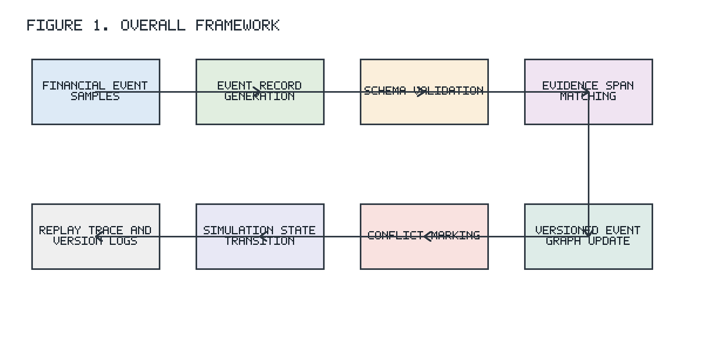
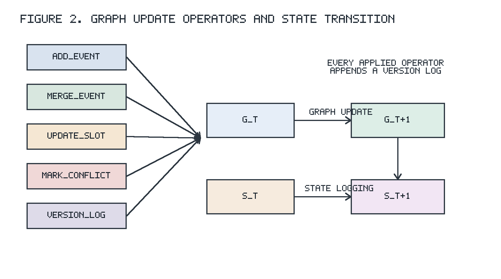
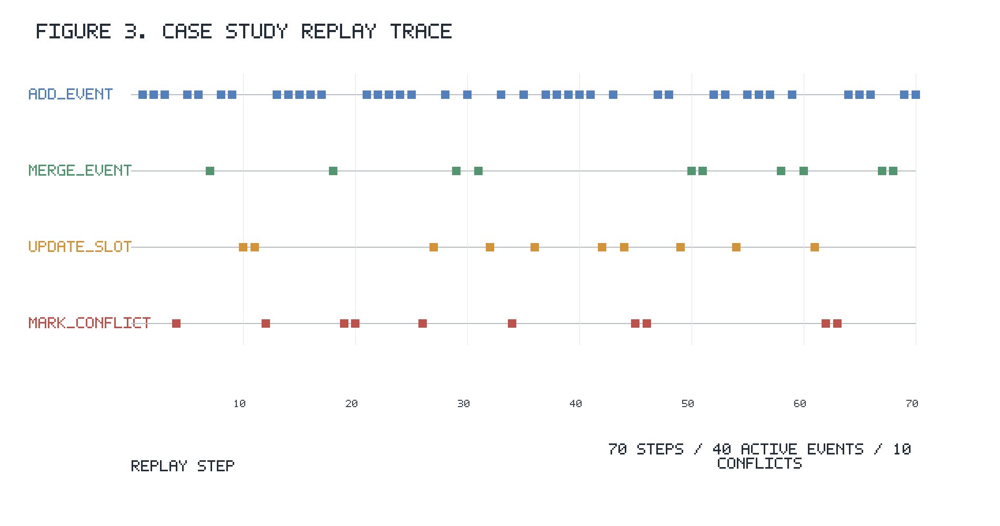

# A Reproducible Versioned Event Graph Prototype for Evidence-Constrained Financial Event Stream Simulation

## Abstract

Financial event extraction systems often produce structured records, but downstream simulation and auditing workflows also require explicit evidence links, graph update histories, and reproducible replay artifacts. This paper presents a reproducible prototype for evidence-constrained financial event stream simulation. The prototype normalizes financial event records, checks exact evidence-span containment, applies a small set of graph update operators to a versioned event graph, and runs a discrete-event replay simulation over a controlled perturbation stream. In the current deterministic run, the prototype replays 70 records, produces 40 active events, writes 70 version logs, and marks 10 unresolved conflicts. The evaluation focuses on framework behavior rather than benchmark-level extraction comparison: schema validity, evidence coverage, update-operator agreement, replay completeness, and trace generation. The results show that the prototype can expose auditable graph transitions under controlled perturbations while keeping claims limited to the implemented reproducibility setting.

## Keywords

event graph; financial event stream; evidence traceability; discrete-event replay; versioned graph

# 1. Introduction

Financial event records are useful only when their origin, update history, and downstream use can be inspected. A record that stores an event type, time, subject, object, and amount is not enough for reproducible simulation if the record is detached from its source text or if later duplicate, update, and conflict operations are not logged. This short-paper prototype studies that narrower infrastructure problem.

The work is a reproducible simulation-oriented prototype, not a financial event extraction benchmark system. It asks whether a controlled stream of financial event records can be checked against source evidence, inserted into a versioned event graph, updated with a small deterministic operator set, and replayed as a discrete-event simulation with auditable traces.

The prototype uses evidence-constrained event records. Each accepted record must satisfy schema checks and must contain an explicit evidence span that appears in its source text. Accepted records are replayed into a versioned event graph. Each replay step appends a version log and emits simulation state indicators, so the graph state can be inspected after every controlled perturbation.

This paper makes three limited contributions. First, it defines a compact event-record and replay-stream format for evidence-constrained financial event stream simulation. Second, it implements deterministic graph update operators for adding events, merging duplicates, updating slots, marking conflicts, and logging versions. Third, it reports a reproducible local and server replay experiment on a controlled perturbation stream with explicit ablation and case-study artifacts.

This paper does not aim to improve state-of-the-art financial event extraction performance. The current evaluation focuses on framework behavior rather than benchmark-level extraction comparison. The prototype uses lightweight rule-based consistency checking modules. Future work will extend the framework to document-level financial event extraction and larger-scale simulation scenarios.

# 2. Related Work

## 2.1 Financial Event Extraction

Financial event extraction studies how to identify events and arguments from financial text. DCFEE addresses document-level Chinese financial event extraction from financial news using automatically labeled data [1]. Doc2EDAG further studies document-level Chinese financial event extraction and represents event-table generation through an entity-based directed acyclic graph [2]. These studies motivate the need for structured financial event records, especially when event arguments are distributed across a document.

The present prototype is different in scope. It does not introduce a new extractor or compare extraction accuracy against document-level extraction systems. It assumes event-like records are available in a deterministic sample file, then studies whether those records can be constrained by evidence, maintained in a versioned graph, and replayed reproducibly.

## 2.2 Event Graph Maintenance

Graph maintenance requires a representation of state changes, provenance, and update history. The W3C PROV-O model provides a vocabulary for provenance descriptions over entities, activities, and agents [3]. Event sourcing describes a software architecture in which state can be reconstructed from an event log [4]. These ideas are relevant to event graph maintenance because they emphasize explicit derivation and state reconstruction.

The prototype follows this general direction in a narrow form. It stores event nodes, entity nodes, event-entity edges, conflict marks, merge records, and append-only version logs. The graph version is the length of the version log, so every accepted replay step leaves an auditable update record.

## 2.3 Financial Event Stream Simulation

Discrete-event simulation models a system as a sequence of event-triggered state transitions [5]. The prototype adopts that view for financial event streams, but it does not model market dynamics or future outcomes. Its replay simulation is an engineering testbed for controlled perturbations: base records, duplicates, conflicts, slot updates, and temporal replay records.

The simulation goal is therefore reproducibility and observability. The controlled perturbation stream carries expected operator metadata, and the replay output records the applied operator, graph state indicators, and evidence-gate results at each step.

# 3. Problem Definition

The task is evidence-constrained financial event stream simulation. The input consists of two related streams.

First, the prototype uses deterministic financial event samples. Each sample contains an event identifier, event type, subject, object, event time, trigger, evidence span, source document identifier, source text, amount, and status. In the current implementation, these samples are stored as JSONL records under `data/samples/seed_financial_events.jsonl`.

Second, the prototype uses a controlled perturbation stream. The stream wraps event payloads with metadata such as `stream_record_id`, `base_event_id`, `gold_group_id`, `arrival_index`, `perturbation_type`, `expected_operator`, `source_doc_id`, and `source_text`. The controlled stream contains base records and deterministic perturbations for duplicate, conflict, update, and temporal replay cases. It is generated under `data/processed/controlled_stream.jsonl`.

The output is a set of replay artifacts that expose both graph state and update history:

- A versioned event graph with active event nodes, entity nodes, event-entity edges, and graph-version logs.
- Version logs that record the operator applied at each replay step and the target event when applicable.
- Conflict marks that store unresolved conflict records produced by rule-based conflict checks.
- Replay traces that record the step-by-step transition history for the controlled stream.
- Simulation state indicators for active events, active entities, merges, updates, conflicts, unresolved conflicts, graph version, and replay step.

The prototype asks four research questions. RQ1 asks how a lightweight schema module can normalize flat event records and nested stream records while rejecting structurally invalid inputs. RQ2 asks how event records can be constrained by explicit evidence spans. RQ3 asks whether a small rule-based operator set can express the graph transitions required by the controlled stream. RQ4 asks whether the controlled perturbation stream can be replayed into a versioned event graph while producing deterministic trace artifacts.

# 4. Methodology

## 4.1 Evidence-Constrained Event Records

Each input item is treated as an event record with event-level fields and source-level evidence. The required event fields are `event_id`, `event_type`, `subject`, `object`, `time`, `trigger`, `evidence_span`, and `source_doc_id`. Stream records may store the event payload under an `event` object while keeping replay metadata at the top level. The schema module normalizes both forms into a flat event record before validation.

An event record is accepted by the evidence module only when its `evidence_span` is a non-empty string and appears in the corresponding `source_text`. This is an exact-span check. It does not infer missing evidence and does not use a learned verifier. In the replay pipeline, schema validation and evidence matching are gate checks before any graph update is applied.

Table 1 lists the required event fields and controlled-stream metadata used by the prototype.

**Table 1. Event record and stream metadata fields.**

| field | required | description |
| --- | --- | --- |
| event_id | yes | Unique event identifier used as the graph event key. |
| event_type | yes | Controlled event category used by matching and update rules. |
| subject | yes | Primary entity participating in the event. |
| object | yes | Secondary entity or value-bearing object of the event. |
| time | yes | ISO date string used for temporal matching. |
| trigger | yes | Trigger phrase associated with the event record. |
| evidence_span | yes | Text span that must appear in the source text. |
| source_doc_id | yes | Identifier of the source document or controlled sample. |
| stream_record_id | no | Optional replay stream record identifier. |
| base_event_id | no | Optional base event used for perturbation grouping. |
| arrival_index | no | Optional replay ordering index. |
| perturbation_type | no | Optional controlled perturbation family. |
| expected_operator | no | Optional expected graph update operator. |
| source_text | no | Optional source text used by evidence matching. |

## 4.2 Versioned Event Graph

At replay step `t`, the prototype maintains a versioned event graph:

`G_t = (V_t, E_t, L_t)`

Here, `V_t` contains active event nodes and entity nodes, `E_t` contains event-entity edges, and `L_t` contains append-only version logs. The graph is stored in memory using dictionaries for event and entity nodes and lists for edges, version logs, conflicts, and merge records.

Each accepted stream record induces a transition:

`G_t -> G_{t+1}`

The transition inserts an event node, merges an incoming duplicate into an existing event, updates slots of a target event, marks a conflict, or appends a version log. The graph version is the length of `L_t`, so every applied operator creates an auditable log entry.

## 4.3 Graph Update Operators

The prototype uses five operators:

- `ADD_EVENT`
- `MERGE_EVENT`
- `UPDATE_SLOT`
- `MARK_CONFLICT`
- `VERSION_LOG`

`ADD_EVENT` inserts an event node, upserts subject and object entity nodes, and appends event-entity edges. `MERGE_EVENT` records that an incoming duplicate refers to a target event without creating a new active event node. `UPDATE_SLOT` records changed slots for a target event and updates the stored event fields. `MARK_CONFLICT` creates an unresolved conflict mark with the incoming event, target event, and source metadata. `VERSION_LOG` appends operator history for every graph transition.

The operator set is intentionally small. It is sufficient for the current controlled stream because the stream contains base records, duplicates, slot updates, conflicts, and temporal replay records. The methodology does not add a reversal operator beyond the five operators listed above.

## 4.4 Discrete-Event Replay Simulation

Replay orders stream records by `arrival_index` when available, with the original file order as a fallback. For each ordered record, the simulator performs schema validation, evidence matching, rule-based operator prediction, target-event selection, graph update execution, and replay-state logging.

The simulation state transition is:

`S_t -> S_{t+1}`

The state vector written to the replay trace contains `graph_version`, `active_event_count`, `active_entity_count`, `merged_event_count`, `updated_slot_count`, `conflict_count`, `unresolved_conflict_count`, and `replay_step`. These indicators are descriptive replay diagnostics. Their role is to make each graph transition observable and reproducible.





## 4.5 Consistency Checking Modules

The prototype uses rule-based consistency checking modules. The schema checker verifies required fields and ISO date format. The evidence checker verifies exact evidence-span containment in the source text. The conflict module predicts an update operator using perturbation metadata when present and simple event-level rules otherwise. Target selection first uses `base_event_id` when it refers to an active graph event, then falls back to matching event type, subject, time proximity, amount, and status.

Duplicate checks compare subject, event type, time proximity, amount, and status. Update checks require an update signal and changed fields. Conflict checks require the same subject and event type, close event time, and a difference in amount or status supported by conflict-like source text or status changes. These modules are deterministic and are designed to expose prototype behavior rather than to estimate real-world event probabilities.

The controlled perturbation stream starts from deterministic financial event samples and adds four perturbation families: duplicates, conflicts, updates, and temporal replay records. Each perturbation includes an `expected_operator` field so that replay behavior can be checked against the intended transition type. In the current controlled run, the seed sample file contains 30 financial event samples and the generated stream contains 70 records.

# 5. Prototype Implementation

The prototype is implemented as a lightweight Python package and a small set of command-line scripts. It is rule-based and uses local JSONL and CSV artifacts for reproducibility.

`src/schema.py` defines event normalization and schema validation. It accepts both flat sample records and controlled stream records whose event payload is nested under `event`. The validator checks required event fields and verifies that `time` is an ISO date string.

`src/evidence.py` implements the evidence constraint. The main check returns true only when a non-empty `evidence_span` appears in `source_text`. This module provides the evidence gate used by the replay simulator and the evidence-coverage metric.

`src/graph_store.py` implements the in-memory versioned event graph. It stores event nodes, entity nodes, event-entity edges, version logs, conflict marks, merge records, and the update-slot counter. Its public graph update methods are `add_event`, `merge_event`, `update_slot`, `mark_conflict`, `append_version_log`, and `snapshot_state`.

`src/conflict.py` contains deterministic operator prediction and target-event selection rules. It maps controlled perturbation metadata to `MERGE_EVENT`, `MARK_CONFLICT`, `UPDATE_SLOT`, or `ADD_EVENT` when available, and otherwise falls back to event matching rules for duplicates, updates, and conflicts.

`src/simulator.py` runs the discrete-event replay. It orders records by `arrival_index`, applies schema and evidence gates, predicts the graph operator, executes the graph update, and writes replay trace entries with simulation state indicators.

`src/metrics.py` builds the ablation rows used in the experiment table. `Direct`, `Schema`, and `Evidence` are component rows with non-applicable merge, conflict, and replay metrics recorded as `NA`. `Full` runs the complete replay and reports schema validity, evidence coverage, merge accuracy, conflict accuracy, replay completeness, runtime per record, and record count.

The intended local reproduction commands are:

```bash
python scripts/run_demo.py
python scripts/run_ablation.py --config configs/stage3_experiment.json --out tables/ablation_results.csv
```

# 6. Experiments and Results

## 6.1 Experimental Setup

The experiment uses the controlled financial event stream generated for the prototype. The current local run processes 70 replay records and writes replay artifacts under `outputs/`, including event records, update logs, conflict logs, version logs, and `outputs/replay_trace.jsonl`.

The experiment is a deterministic prototype check rather than a financial event extraction benchmark. It uses the implemented schema checker, exact evidence-span matcher, rule-based graph update operators, and replay-state logger. No model training, GPU inference, external API call, or market forecasting component is used.

Figure 1 summarizes the overall pipeline from financial event samples to replay traces and version logs. Figure 2 summarizes the implemented graph update operators and the corresponding graph and simulation-state transitions. Figure 3 visualizes the case-study replay trace generated from the current replay artifacts.

## 6.2 Metrics

The ablation table reports schema validity, evidence coverage, merge accuracy, conflict accuracy, replay completeness, runtime per record, and record count. `Direct`, `Schema`, and `Evidence` are component rows, so merge, conflict, and replay metrics are marked as `NA` when they are not applicable. `Full` runs the complete replay pipeline and reports graph-update and replay metrics against the controlled stream metadata.

Schema validity measures whether records pass the required event-record fields and ISO-date checks. Evidence coverage measures whether the evidence span appears in the source text. Merge accuracy and conflict accuracy compare predicted operators with the controlled stream's expected operators for duplicate and conflict perturbations. Replay completeness measures whether replay steps are applied and logged.

## 6.3 Results

Table 2 reports the current ablation output generated from `tables/ablation_results.csv`. In this controlled run, all four rows contain 70 records. Schema validity and evidence coverage are `1.000000` for `Direct`, `Schema`, `Evidence`, and `Full`; the component rows keep non-applicable merge, conflict, and replay metrics as `NA`.

The `Full` row reports merge accuracy `1.000000`, conflict accuracy `1.000000`, and replay completeness `1.000000` on the controlled stream. These values describe agreement with deterministic perturbation metadata in the current prototype run. They should not be interpreted as broad extraction accuracy or real-world financial utility.

**Table 2. Ablation results from the current controlled stream.**

| method | schema_validity | evidence_coverage | merge_accuracy | conflict_accuracy | replay_completeness | runtime_ms_per_record | num_records |
| --- | --- | --- | --- | --- | --- | --- | --- |
| Direct | 1.000000 | 1.000000 | NA | NA | NA | 0.000968 | 70 |
| Schema | 1.000000 | 1.000000 | NA | NA | NA | 0.001514 | 70 |
| Evidence | 1.000000 | 1.000000 | NA | NA | NA | 0.002091 | 70 |
| Full | 1.000000 | 1.000000 | 1.000000 | 1.000000 | 1.000000 | 0.013303 | 70 |

The results indicate that schema constraints provide structural validity checks and evidence constraints provide traceability checks. The full prototype further supports duplicate merging, slot updating, conflict marking, and replay trace generation.

## 6.4 Case Study

The case study converts `outputs/replay_trace.jsonl`, `outputs/updates.jsonl`, and `outputs/conflicts.jsonl` into `tables/case_study_updates.csv`. The current case study contains 70 replay rows with the operators `ADD_EVENT`, `MERGE_EVENT`, `UPDATE_SLOT`, and `MARK_CONFLICT`. The replay starts by adding evidence-backed event nodes, then records duplicate merges, slot updates, and unresolved conflict marks as they appear in the controlled stream.

**Table 3. Excerpt from the case-study update log.**

| case_id | replay_step | operator | event_id | target_event_id | summary |
| --- | --- | --- | --- | --- | --- |
| CS0001 | 1 | ADD_EVENT | E000016 | E000016 | Added an evidence-backed event node to the active graph. |
| CS0004 | 4 | MARK_CONFLICT | E000003_CON003 | E000003 | Marked unresolved conflict C000001. |
| CS0007 | 7 | MERGE_EVENT | E000010_DUP010 | E000010 | Merged duplicate event into target E000010. |
| CS0010 | 10 | UPDATE_SLOT | E000004_UPD004 | E000004 | Updated slots: amount, evidence_span, object, status, time, trigger |
| CS0032 | 32 | UPDATE_SLOT | E000003_UPD003 | E000003_TS003 | Updated slots: amount, evidence_span, object, status, time |
| CS0063 | 63 | MARK_CONFLICT | E000004_CON004 | E000004_TS004 | Marked unresolved conflict C000010. |



The final replay trace contains 70 steps, 40 active events, 70 version logs, 10 merged events, 10 updated-slot operations, and 10 unresolved conflict marks. This case study demonstrates that the prototype can expose graph updates and state changes as auditable artifacts for the controlled stream.

# 7. Discussion

The prototype is useful as a reproducible framework check. It makes the path from event record to graph update explicit, and it stores evidence-gate results and graph-state indicators at each replay step. This helps separate two questions that are often conflated: whether an event extractor can find records from documents, and whether a downstream graph and replay framework can maintain those records with traceable updates.

The limitations are central to the design. This paper does not aim to improve state-of-the-art financial event extraction performance. The current evaluation focuses on framework behavior rather than benchmark-level extraction comparison. The prototype uses lightweight rule-based consistency checking modules. The controlled stream is compact and deterministic, so it is suitable for auditing implementation behavior but not for broad claims about extraction quality.

The versioned event graph is also intentionally small. It keeps append-only version logs and conflict marks, but it does not yet implement rich conflict resolution, human review workflows, or large-scale graph storage. The evidence check is exact span containment and does not handle paraphrases, indirect evidence, or multi-sentence evidence aggregation.

# 8. Conclusion

This paper presented a reproducible prototype for evidence-constrained financial event stream simulation. The prototype normalizes event records, verifies exact evidence-span containment, applies rule-based graph update operators to a versioned event graph, and replays a controlled perturbation stream as a discrete-event simulation.

In the current run, the prototype processes 70 replay records, writes 70 version logs, and exposes deterministic state transitions through replay artifacts. These results support a limited conclusion: the implemented framework can make controlled financial event graph updates reproducible and auditable. Future work will extend the framework to document-level financial event extraction and larger-scale simulation scenarios.

# References

[1] H. Yang, Y. Chen, K. Liu, Y. Xiao, and J. Zhao. 2018. DCFEE: A Document-level Chinese Financial Event Extraction System. Proceedings of ACL 2018 System Demonstrations, 50-55. https://aclanthology.org/P18-4009/

[2] S. Zheng, W. Cao, W. Xu, and J. Bian. 2019. Doc2EDAG: An End-to-End Document-level Framework for Chinese Financial Event Extraction. Proceedings of EMNLP-IJCNLP 2019, 337-346. https://aclanthology.org/D19-1032/

[3] T. Lebo, S. Sahoo, D. McGuinness, K. Belhajjame, J. Cheney, D. Corsar, D. Garijo, S. Soiland-Reyes, S. Zednik, and J. Zhao. 2013. PROV-O: The PROV Ontology. W3C Recommendation. https://www.w3.org/TR/prov-o/

[4] M. Fowler. 2005. Event Sourcing. https://martinfowler.com/eaaDev/EventSourcing.html

[5] J. Banks, J. S. Carson II, B. L. Nelson, and D. M. Nicol. 2010. Discrete-Event System Simulation. Fifth edition. Pearson.
